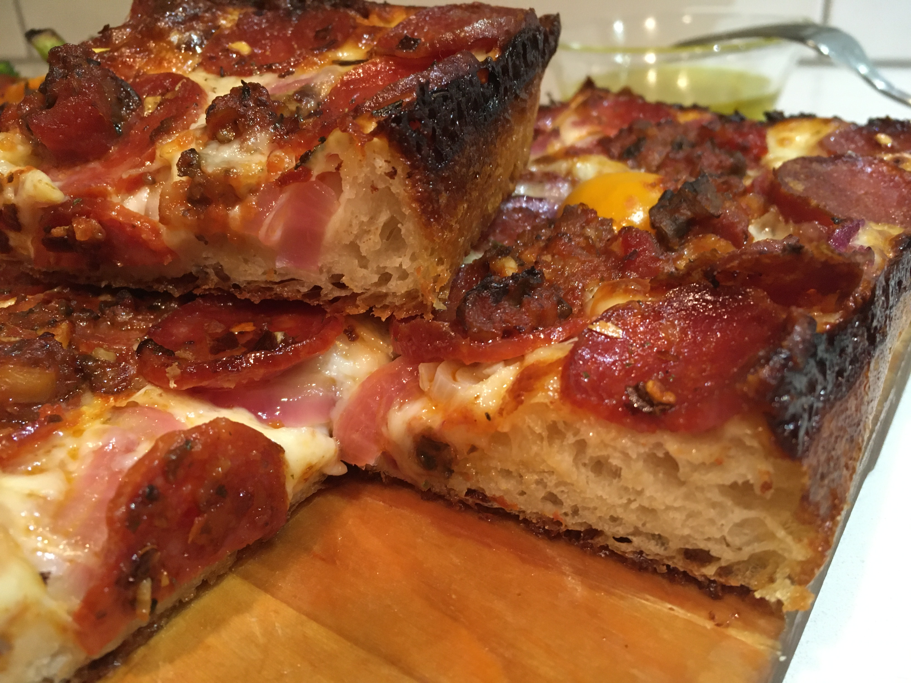

# Mom/Detroit Pizza

## Overview
- Easy
- Work: 1h
- Total: 4h
## Hardware
- Oven
- Mixer
- Pan ~13x9x2in
## Food
- 11.25 oz APF
- 1.5 Tsp Yeast
- 1.5 Tsp sugar
- 1 cup water room temp
- 1.5 Tsp salt
- 1 Tbsp EEVO
## Steps
### First
- Add all but salt to mixer
- Mix 2m; note dough is not silky
- Rest 10m
### Then
- Add salt
- Mix ~7m until silky
- Oil pan
- Drop dough in pan
- Rest 2-3h
### Then
- Spread dough to edges
### Then
1. Top with grated cheese
1. Top with toppings
1. Drizzle sauce in lines like on a football field
### Bake
- 15-20m at 500 on lower shelf
## Photos

