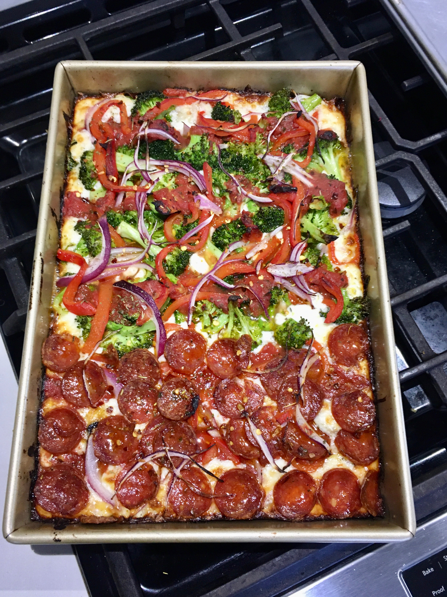

# Grandma pizza

## Overview
- Easy
- Work: 1h
- Total: 4h
## Hardware
- Oven
- Mixer w/dough hook
- Pan ~13x9x2in
## Ingredients
### First
- 11.25 oz all purpose flour
- 1.5 Tsp yeast
- 1.5 Tsp sugar
- 1 cup water room temp
### Second
- 1.5 Tsp salt
### Last
- 1 Tbsp EEVO
- 1 cup mozzarella
- Toppings might be pepperoni, onions, bell peppers, broccoli...
## Steps
### First
- Mix "First" ingredients 2m
- Rest 10m
### Then
- Add salt
- Mix ~7m
- Oil pan
- Drop dough in pan
- Wait 20m
### Then
- Spread dough to edges
- Cover with cloth/other
- Rest 2-4h depending on room temp; should poof up ~2x 
### Then
1. Top with grated cheese
1. Top with toppings
1. Drizzle sauce in lines like on a football field
### Bake
- 15-20m at 500F on lower shelf
## Pro Notes
- After first 2m of mixing dough will be rough; the latter ~7m will make it silky
- Put cheese into/along pan edges
- Rebake it in toaster oven next day for 10m+ at 350F for super-crispiness
## Photos

