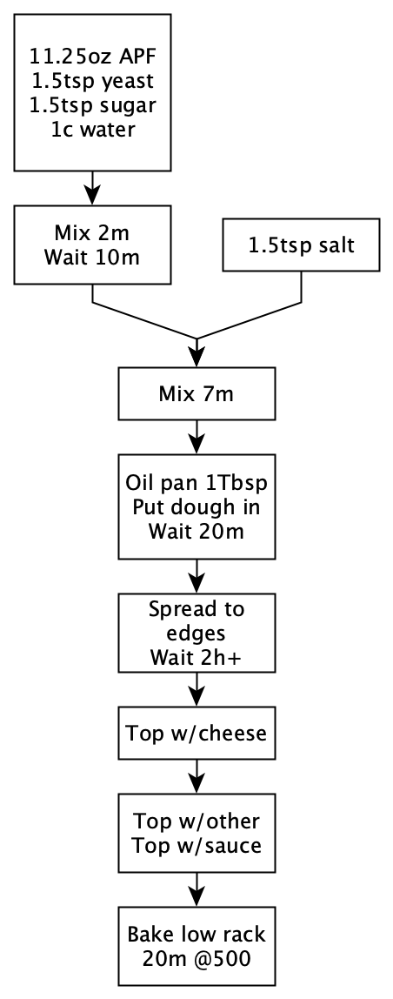

# Grandma pizza

## Overview
- Easy
- Work: 1h
- Total: 3h
## Hardware
- Oven
- Mixer with dough hook
- Pan ~13x9x2in
## Ingredients
- 11.25 oz all purpose flour
- 1.5 Tsp yeast
- 1.5 Tsp sugar
- 1.5 Tsp salt
- 1 Tbsp olive oil
- 1 cup water room temp
- 1 cup mozzarella cheese
- Toppings might be pepperoni, onions, bell peppers, broccoli...

## Flow

Pre-stretch

Post-stretch

## Pix 

Or add some cheese if you like.

## Pro Notes
- After first 2m of mixing dough will be rough; the latter ~7m will make it silky
- Put cheese into/along pan edges
- Rebake it in toaster oven next day for 10m+ at 350F for super-crispiness
- Halve the ingredients and use a 9x9in pan
- This may be more like "Detroit" pizza

## Veg
- Toss the brocc in oil to protect it from the heat
- Lookup kale-pistachio pesto; lasts long in the fridge and insulates the brocc well, as opposed to just oil

